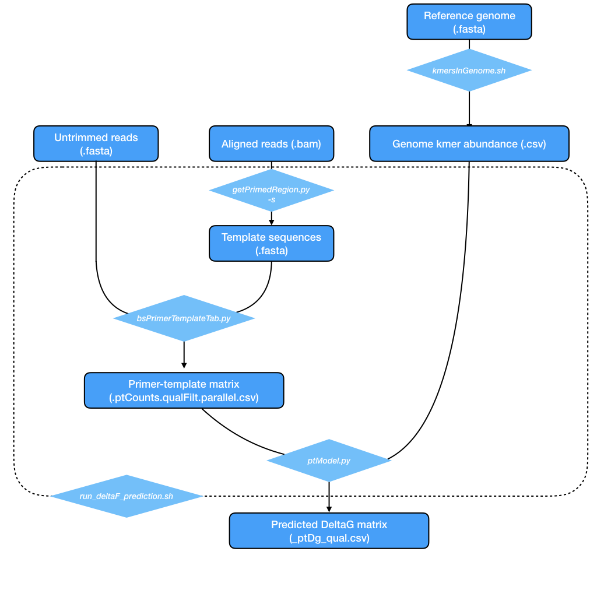

## Prediction of Delta G from sequencing data
Computes predicted Delta G for hexamer binding energy from sequencing reads. For details of model see report.

Use ```run_deltaF_prediction``` which runs the python scripts as described in workflow:


